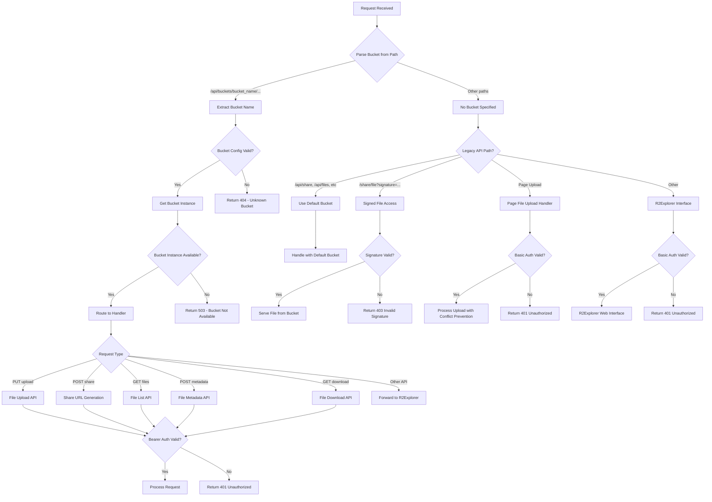
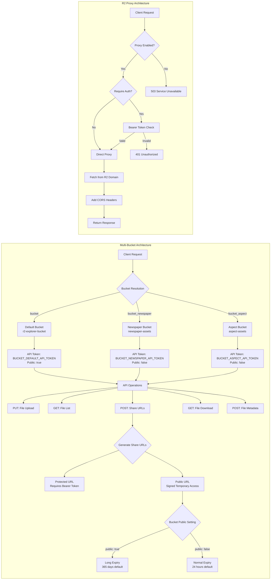

# R2 Explorer Template

[](https://deploy.workers.cloudflare.com/?url=https://github.com/cloudflare/templates/tree/main/r2-explorer-template)


A **Google Drive-like interface** for Cloudflare R2 storage with secure file sharing, multi-bucket support, and comprehensive API access.

## ✨ Features

### 🔒 **Dual Authentication System**
- **Web Interface**: Basic Auth for human users
- **API Access**: Bearer Token for applications  
- Secure file sharing with signed temporary URLs

### 🪣 **Multi-Bucket Support**
- Multiple R2 buckets with independent security isolation
- Per-bucket API tokens and custom domains
- Flexible bucket access control (public/private)

### 📁 **File Management**
- Drag-and-drop uploads with auto-generated share links
- Multi-part upload for large files
- Folder creation and organization
- In-browser preview (PDF, images, text, markdown, CSV)
- Conflict prevention with automatic file renaming

### 🔗 **Smart File Sharing**
- **Protected URLs**: Require Bearer token, full access control
- **Public URLs**: Signed temporary links with configurable expiration
- Unified share URL structure across all buckets

## 🚀 Quick Start

### 1. Create Project
```bash
npm create cloudflare@latest -- --template=cloudflare/templates/r2-explorer-template
cd your-project-name
npm install
```

### 2. Setup R2 Buckets
```bash
# Create your buckets
npx wrangler r2 bucket create r2-explorer-bucket
npx wrangler r2 bucket create newspaper-assets
npx wrangler r2 bucket create aspect-assets
```

### 3. Configure Multi-Bucket Setup

**wrangler.json**:
```json
{
  "r2_buckets": [
    {
      "binding": "bucket",
      "bucket_name": "r2-explorer-bucket"
    },
    {
      "binding": "bucket_newspaper", 
      "bucket_name": "newspaper-assets"
    },
    {
      "binding": "bucket_aspect",
      "bucket_name": "aspect-assets"
    }
  ]
}
```

### 4. Environment Variables
Set up in [Cloudflare Dashboard](https://dash.cloudflare.com) → **Workers & Pages** → **Settings** → **Variables & Secrets**:

| Variable | Type | Description | Example |
|----------|------|-------------|---------|
| `ADMIN_USERNAME` | Text | Web interface username | `admin` |
| `ADMIN_PASSWORD` | **Secret** | Web interface password | `your-secure-password` |
| `BUCKET_DEFAULT_API_TOKEN` | **Secret** | Default bucket API token | `sk-default-token` |
| `BUCKET_NEWSPAPER_API_TOKEN` | **Secret** | Newspaper bucket API token | `sk-newspaper-token` |
| `BUCKET_ASPECT_API_TOKEN` | **Secret** | Aspect bucket API token | `sk-aspect-token` |
| `SHARE_LINK_EXPIRES_HOURS` | Text | Normal share link expiry | `24` |
| `PUBLIC_LINK_EXPIRES_HOURS` | Text | Public bucket link expiry | `8760` (365 days) |

### 5. Deploy
```bash
npx wrangler deploy
```

## 🏗️ Architecture

### Request Processing Flow



### Multi-Bucket Architecture



## 🔑 API Reference

### Bucket Configuration

The system supports multiple buckets with independent configurations:

| Bucket Key | Bucket Name | Public | Default Token Env | Custom Domain Env |
|------------|-------------|--------|-------------------|-------------------|
| `bucket` | r2-explorer-bucket | `true` | `BUCKET_DEFAULT_API_TOKEN` | `BUCKET_DEFAULT_CUSTOM_DOMAIN` |
| `bucket_newspaper` | newspaper-assets | `false` | `BUCKET_NEWSPAPER_API_TOKEN` | `BUCKET_NEWSPAPER_CUSTOM_DOMAIN` |
| `bucket_aspect` | aspect-assets | `false` | `BUCKET_ASPECT_API_TOKEN` | `BUCKET_ASPECT_CUSTOM_DOMAIN` |

### API Endpoints

All API endpoints follow the pattern: `/api/buckets/{bucketKey}/{operation}`

| Method | Endpoint | Description | Authentication |
|--------|----------|-------------|----------------|
| `PUT` | `/api/buckets/{bucket}/{filename}` | Upload file | Bearer Token |
| `GET` | `/api/buckets/{bucket}/files` | List files | Bearer Token |
| `POST` | `/api/buckets/{bucket}/share` | Generate share URLs | Bearer Token |
| `POST` | `/api/buckets/{bucket}/metadata` | Get file metadata | Bearer Token |
| `GET` | `/api/buckets/{bucket}/{filename}?download=true` | Download file | Bearer Token |

### R2 Proxy Endpoints

| Method | Endpoint | Description | Authentication |
|--------|----------|-------------|----------------|
| `GET` | `/proxy/{filename}` | Proxy file access | Optional |
| `GET` | `/proxy/{filename}?download=true` | Proxy file download | Optional |

### Share URL Structure

All file uploads and share requests return a unified URL structure:

```json
{
  "success": true,
  "share_urls": {
    "protected": {
      "view": "https://worker.dev/api/buckets/bucket_name/filename",
      "download": "https://worker.dev/api/buckets/bucket_name/filename?download=true"
    },
    "public": {
      "view": "https://worker.dev/share/filename?signature=...&expires=...&bucket=bucket_name",
      "download": "https://worker.dev/share/filename?signature=...&expires=...&download=true&bucket=bucket_name",
      "expires_at": "2025-01-01T12:00:00.000Z",
      "expires_in_hours": 24,
      "is_long_term": false
    }
  }
}
```

**URL Types:**
- **Protected**: Require Bearer token, immediate access control
- **Public**: Signed URLs, time-limited access without authentication

**Expiration Logic:**
- `public: true` buckets → Use `PUBLIC_LINK_EXPIRES_HOURS` (default: 8760 hours = 365 days)
- `public: false` buckets → Use `SHARE_LINK_EXPIRES_HOURS` (default: 24 hours)

## 💻 Usage Examples

### File Upload
```bash
# Upload to specific bucket
curl -X PUT "https://your-worker.dev/api/buckets/bucket_newspaper/news.jpg" \
  -H "Authorization: Bearer sk-newspaper-token" \
  -H "Content-Type: image/jpeg" \
  --data-binary @news.jpg

# Response includes share URLs
{
  "success": true,
  "file": {
    "originalFilename": "news.jpg",
    "storedFilename": "news.jpg", 
    "conflictPrevented": false
  },
  "share_urls": {
    "protected": { /* ... */ },
    "public": { /* ... */ }
  }
}
```

### Generate Share URLs
```bash
# Generate share URLs for existing file
curl -X POST "https://your-worker.dev/api/buckets/bucket_newspaper/share" \
  -H "Authorization: Bearer sk-newspaper-token" \
  -H "Content-Type: application/json" \
  -d '{"filename": "news.jpg", "expires_in": 3600}'
```

### List Files
```bash
# List files in specific bucket
curl "https://your-worker.dev/api/buckets/bucket_newspaper/files" \
  -H "Authorization: Bearer sk-newspaper-token"
```

### Access Files
```bash
# Protected access (requires token)
curl "https://your-worker.dev/api/buckets/bucket_newspaper/news.jpg" \
  -H "Authorization: Bearer sk-newspaper-token"

# Public access (no token required)
curl "https://your-worker.dev/share/news.jpg?signature=...&expires=...&bucket=bucket_newspaper"

# R2 Proxy access (CORS-safe)
curl "https://your-worker.dev/proxy/Reve-Image/1.webp"
```

### TypeScript SDK Integration

Create a TypeScript SDK for easy API integration:

```typescript
// r2-explorer-sdk.ts
export interface ShareUrls {
  protected: {
    view: string;
    download: string;
  };
  public: {
    view: string;
    download: string;
    expires_at: string;
    expires_in_hours: number;
    is_long_term: boolean;
  };
}

export interface UploadResult {
  success: boolean;
  file: {
    originalFilename: string;
    storedFilename: string;
    conflictPrevented: boolean;
  };
  share_urls: ShareUrls;
}

export interface FileMetadata {
  filename: string;
  size: number;
  contentType: string;
  lastModified: string;
  etag: string;
  customMetadata?: Record<string, string>;
}

export interface FileItem {
  name: string;
  size: number;
  lastModified: string;
  etag: string;
  displayName?: string;
  isVersioned: boolean;
}

interface R2Client {
  upload: (filename: string, file: File | Blob | ArrayBuffer | string, contentType?: string) => Promise<UploadResult>;
  list: (prefix?: string, limit?: number) => Promise<FileItem[]>;
  share: (filename: string, expiresIn?: number) => Promise<ShareUrls>;
  metadata: (filename: string) => Promise<FileMetadata>;
  download: (filename: string) => Promise<Blob>;
  getUrl: (filename: string, forceDownload?: boolean) => string;
  uploadAndShare: (filename: string, file: File | Blob | ArrayBuffer | string, options?: {
    contentType?: string;
    expiresIn?: number;
  }) => Promise<{ upload: UploadResult; shareUrls: ShareUrls }>;
}

/**
 * Create R2 Explorer client for a specific bucket
 */
export function createR2Client(config: {
  baseUrl: string;
  bucketName: string;
  apiToken: string;
}): R2Client {
  const { baseUrl, bucketName, apiToken } = config;
  const cleanBaseUrl = baseUrl.replace(/\/+$/, '');

  const request = async <T>(endpoint: string, options: RequestInit = {}): Promise<T> => {
    const url = `${cleanBaseUrl}/api/buckets/${bucketName}${endpoint}`;
    
    const response = await fetch(url, {
      ...options,
      headers: {
        'Authorization': `Bearer ${apiToken}`,
        'Content-Type': 'application/json',
        ...options.headers,
      },
    });

    if (!response.ok) {
      const errorText = await response.text();
      let errorMessage: string;
      
      try {
        const errorJson = JSON.parse(errorText);
        errorMessage = errorJson.message || errorJson.error || `HTTP ${response.status}`;
      } catch {
        errorMessage = errorText || `HTTP ${response.status}`;
      }
      
      throw new Error(`API Error: ${errorMessage}`);
    }

    return response.json();
  };

  return {
    async upload(filename: string, file: File | Blob | ArrayBuffer | string, contentType?: string): Promise<UploadResult> {
      const url = `${cleanBaseUrl}/api/buckets/${bucketName}/${encodeURIComponent(filename)}`;
      
      const response = await fetch(url, {
        method: 'PUT',
        headers: {
          'Authorization': `Bearer ${apiToken}`,
          'Content-Type': contentType || (file instanceof File ? file.type : 'application/octet-stream')
        },
        body: file
      });

      if (!response.ok) {
        throw new Error(`Upload failed: ${response.statusText}`);
      }

      return response.json();
    },

    async list(prefix?: string, limit?: number): Promise<FileItem[]> {
      const url = new URL(`${cleanBaseUrl}/api/buckets/${bucketName}/files`);
      if (prefix) url.searchParams.set('prefix', prefix);
      if (limit) url.searchParams.set('limit', limit.toString());

      const response = await fetch(url.toString(), {
        headers: {
          'Authorization': `Bearer ${apiToken}`
        }
      });

      if (!response.ok) {
        throw new Error(`List failed: ${response.statusText}`);
      }

      const result = await response.json();
      return result.files;
    },

    async share(filename: string, expiresIn?: number): Promise<ShareUrls> {
      const body: any = { filename };
      if (expiresIn) body.expires_in = expiresIn;

      const result = await request<{ data: ShareUrls }>('/share', {
        method: 'POST',
        body: JSON.stringify(body)
      });

      return result.data;
    },

    async metadata(filename: string): Promise<FileMetadata> {
      const result = await request<{ metadata: FileMetadata }>('/metadata', {
        method: 'POST',
        body: JSON.stringify({ filename })
      });

      return result.metadata;
    },

    async download(filename: string): Promise<Blob> {
      const url = `${cleanBaseUrl}/api/buckets/${bucketName}/${encodeURIComponent(filename)}?download=true`;
      
      const response = await fetch(url, {
        headers: {
          'Authorization': `Bearer ${apiToken}`
        }
      });

      if (!response.ok) {
        throw new Error(`Download failed: ${response.statusText}`);
      }

      return response.blob();
    },

    getUrl(filename: string, forceDownload: boolean = false): string {
      const url = `${cleanBaseUrl}/api/buckets/${bucketName}/${encodeURIComponent(filename)}`;
      return forceDownload ? `${url}?download=true` : url;
    },

    async uploadAndShare(filename: string, file: File | Blob | ArrayBuffer | string, options: {
      contentType?: string;
      expiresIn?: number;
    } = {}): Promise<{ upload: UploadResult; shareUrls: ShareUrls }> {
      const upload = await this.upload(filename, file, options.contentType);
      const shareUrls = await this.share(upload.file.storedFilename, options.expiresIn);
      
      return { upload, shareUrls };
    }
  };
}

// Usage Examples

// Create client for newspaper bucket
const newspaperClient = createR2Client({
  baseUrl: 'https://your-worker.dev',
  bucketName: 'bucket_newspaper',
  apiToken: 'sk-newspaper-token'
});

// Upload file
const file = new File(['news content'], 'breaking-news.txt', { type: 'text/plain' });
const result = await newspaperClient.upload('breaking-news.txt', file);
console.log('Upload successful:', result.file.storedFilename);
console.log('Protected URL:', result.share_urls.protected.view);
console.log('Public URL:', result.share_urls.public.view);

// List files
const files = await newspaperClient.list('news/', 50);
console.log(`Found ${files.length} files`);

// Generate share URLs for existing file
const shareUrls = await newspaperClient.share('article.pdf', 7200); // 2 hours
console.log('Share link expires at:', shareUrls.public.expires_at);

// Get file metadata
const metadata = await newspaperClient.metadata('image.jpg');
console.log(`File size: ${metadata.size} bytes`);

// Download file
const fileBlob = await newspaperClient.download('document.pdf');
const downloadUrl = URL.createObjectURL(fileBlob);

// Upload and share in one call
const { upload, shareUrls: newShareUrls } = await newspaperClient.uploadAndShare(
  'banner.png', 
  imageFile, 
  { 
    contentType: 'image/png',
    expiresIn: 3600 // 1 hour expiry
  }
);

// Create multiple clients for different buckets
const aspectClient = createR2Client({
  baseUrl: 'https://your-worker.dev',
  bucketName: 'bucket_aspect',
  apiToken: 'sk-aspect-token'
});

// Each client manages its own bucket
await aspectClient.upload('logo.svg', svgFile);
await newspaperClient.upload('article.md', markdownFile);
```

## 🛡️ Security Features

### Access Control
- **Bucket Isolation**: Each bucket uses independent API tokens
- **Token Validation**: Bearer tokens are validated per bucket
- **Signature Verification**: Public URLs use HMAC-SHA256 signatures

### Conflict Prevention
- Automatic file renaming to prevent overwrites
- Unique timestamp + random ID generation
- Original filename preservation in metadata

### Expiration Control
- Configurable expiration times per bucket type
- Environment variable override support
- Automatic cleanup of expired signatures

## 🔧 Advanced Configuration

### Custom Domains (Optional)
Configure per-bucket custom domains for direct R2 access:

```bash
# Set custom domains
wrangler secret put BUCKET_NEWSPAPER_CUSTOM_DOMAIN
# Value: cdn.newspaper.com

wrangler secret put BUCKET_ASPECT_CUSTOM_DOMAIN  
# Value: assets.aspect.dev
```

### Deployment with Secrets
```bash
# Set all required secrets
wrangler secret put ADMIN_PASSWORD
wrangler secret put BUCKET_DEFAULT_API_TOKEN
wrangler secret put BUCKET_NEWSPAPER_API_TOKEN
wrangler secret put BUCKET_ASPECT_API_TOKEN

# Set R2 proxy configuration
wrangler secret put R2_PROXY_ENABLED
wrangler secret put R2_PROXY_REQUIRE_AUTH
wrangler secret put R2_PROXY_DOMAIN

# Set public variables
wrangler vars set ADMIN_USERNAME admin
wrangler vars set SHARE_LINK_EXPIRES_HOURS 24
wrangler vars set PUBLIC_LINK_EXPIRES_HOURS 8760

# Deploy
wrangler deploy
```

## 🔍 Troubleshooting

### Common Issues

**Unknown Bucket Error**
- Verify bucket binding in `wrangler.json`
- Check bucket key in URL matches configuration
- Available buckets: `bucket`, `bucket_newspaper`, `bucket_aspect`

**Authentication Failures**
- Ensure correct API token for specific bucket
- Check Bearer token format: `Authorization: Bearer sk-token`
- Verify token environment variable name

**File Access 404**
- For public URLs, ensure `bucket` parameter is included
- Check signature and expiration parameters
- Verify file exists in correct bucket

### Debug Commands
```bash
# Test bucket access
curl "https://your-worker.dev/api/buckets/bucket_newspaper/files" \
  -H "Authorization: Bearer wrong-token"
# Should return 401

# Test unknown bucket
curl "https://your-worker.dev/api/buckets/nonexistent/files" \
  -H "Authorization: Bearer any-token"  
# Should return 404 with available buckets list
```

## 🙏 Acknowledgments

- [R2Explorer](https://github.com/cloudflare/r2-explorer) - Web interface foundation
- [Cloudflare Workers](https://workers.cloudflare.com/) - Serverless platform
- [Cloudflare R2](https://www.cloudflare.com/products/r2/) - Object storage